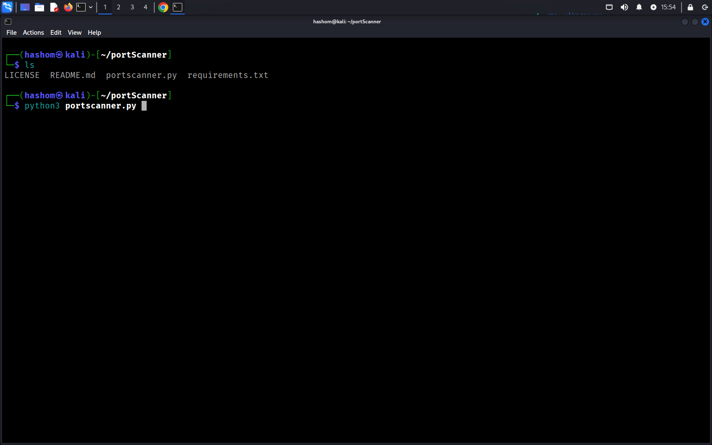
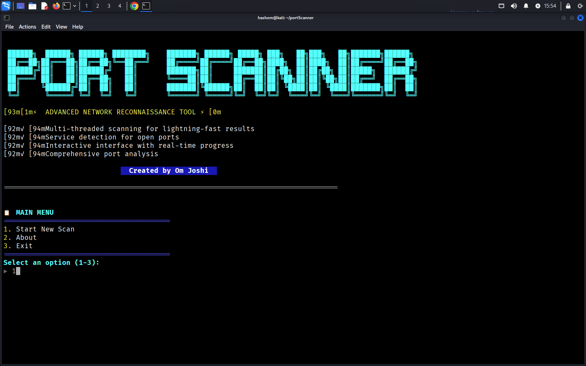
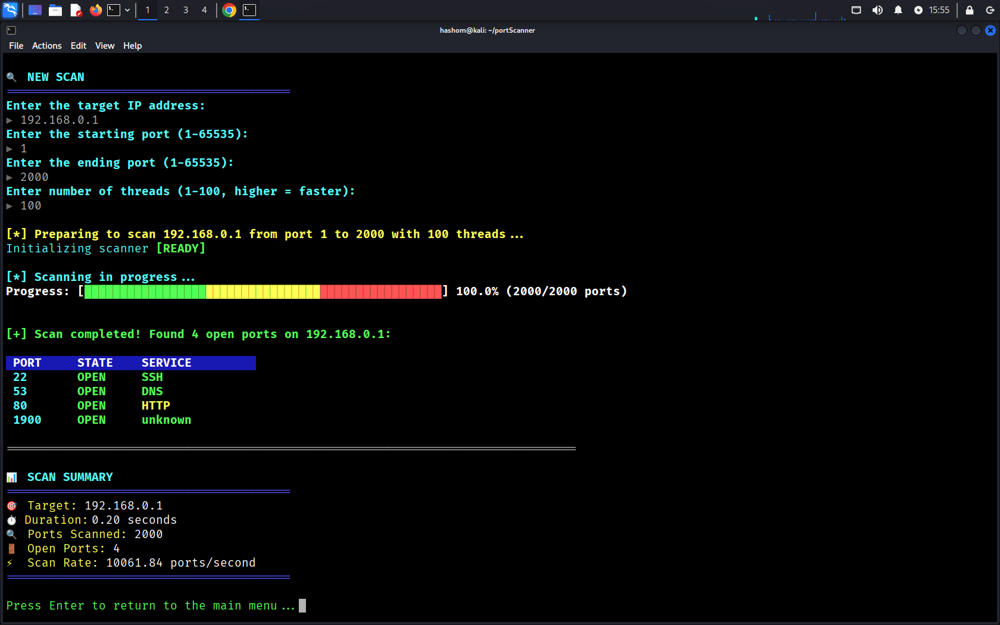

# portScanner

> 🔍 **A Port Scanning Script in Python**

portScanner is a visually engaging Python-based port scanner designed for cybersecurity enthusiasts, and network admins. With a mix of terminal aesthetics, colorful animations, and real-time progress tracking, it makes port scanning not just functional — but *fun and interactive*.

---

## Features

- **Colorful CLI Interface**  
- **Smart Input Validation** (for IPs and ports)  
- **Multi-threaded Port Scanning**  
- **Live Progress Bar with Animations**  
- **Elegant Summary of Open Ports & Services**  
- **Cross-Platform Terminal Compatibility**

---

## 🖥️ Screenshots




## ⚙️ How It Works

1. You enter the **target IP** and **port range**.
2. The scanner validates inputs and begins scanning using sockets.
3. Open ports are displayed along with **service names** (HTTP, FTP, etc.).
4. Once scanning completes, a **summary** is shown including total time and scan rate.

---

## 🛠️ Installation

### 🔧 Requirements

- Python 3.6+
- Works on Linux, macOS, and Windows (with minor tweaks)

### 📦 Setup

```bash
git clone https://github.com/iamomjoshi/portScanner.git
cd portScanner
pip install -r requirements.txt
python3 portscanner.py
```

---

## 📁 File Structure

```
📂 portScanner/
├── LICENSE            # License
├── portscanner.py     # Main script
├── README.md          # Project documentation
├── requirements.txt   # Requirements
```

---

## Usage

Simply run the script and follow the on-screen prompts:

```bash
python3 portscanner.py
```

You will be asked to enter:

- Target IP Address
- Port Range (e.g., 20-100)

Sit back and enjoy the show 🎭

---

## 🧑‍💻 Author

**Om Joshi**  
Cybersecurity Enthusiast | Network Engineer  
📧 omjoshi1k@gmail.com  
🔗 [LinkedIn]([https://linkedin.com/in/omketanjoshi](https://www.linkedin.com/in/om-joshi-327bb8314/))

---

## 🛡️ Disclaimer

> This tool is **intended for educational and ethical use only**. Do not use it on networks without permission. The author is not responsible for any misuse.

---

## ⭐ Show Your Support

If you like this project, consider giving it a ⭐ on GitHub and sharing it with your friends and classmates!

---
